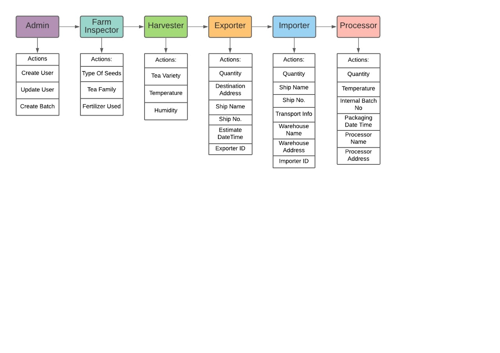
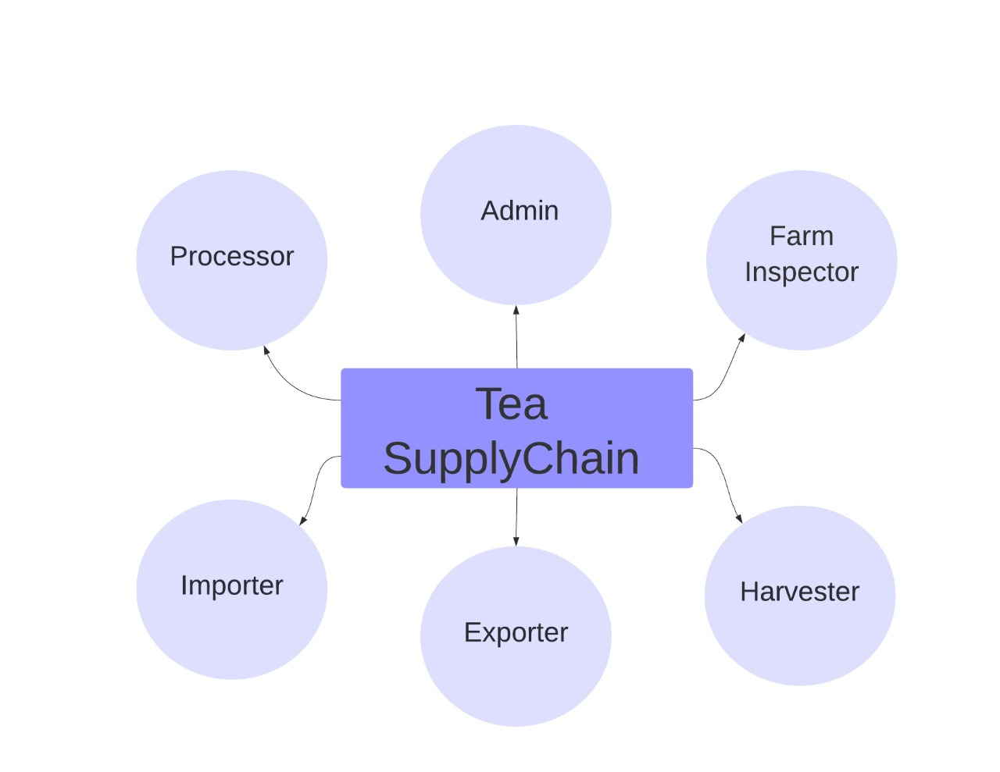
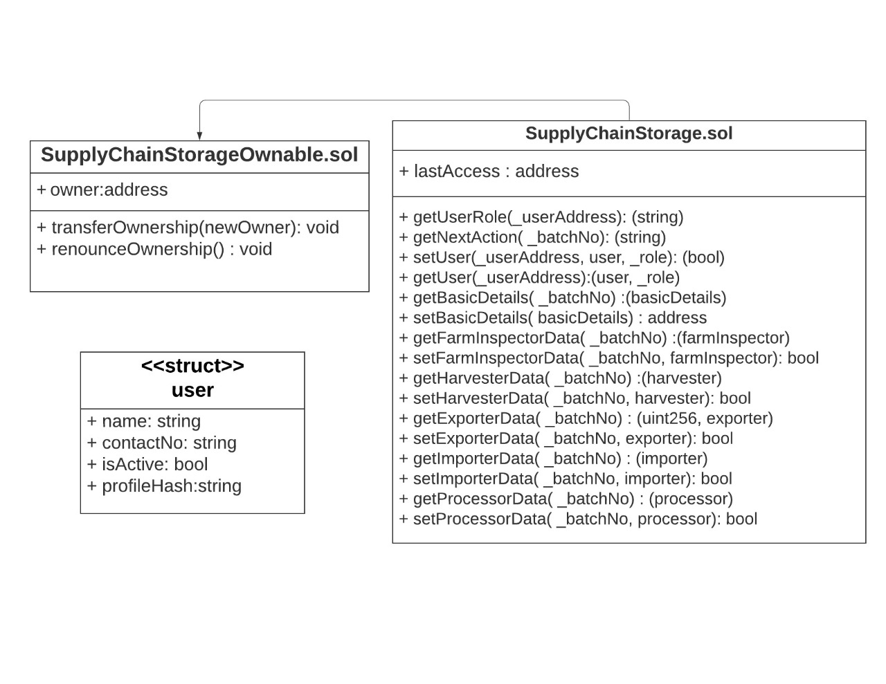
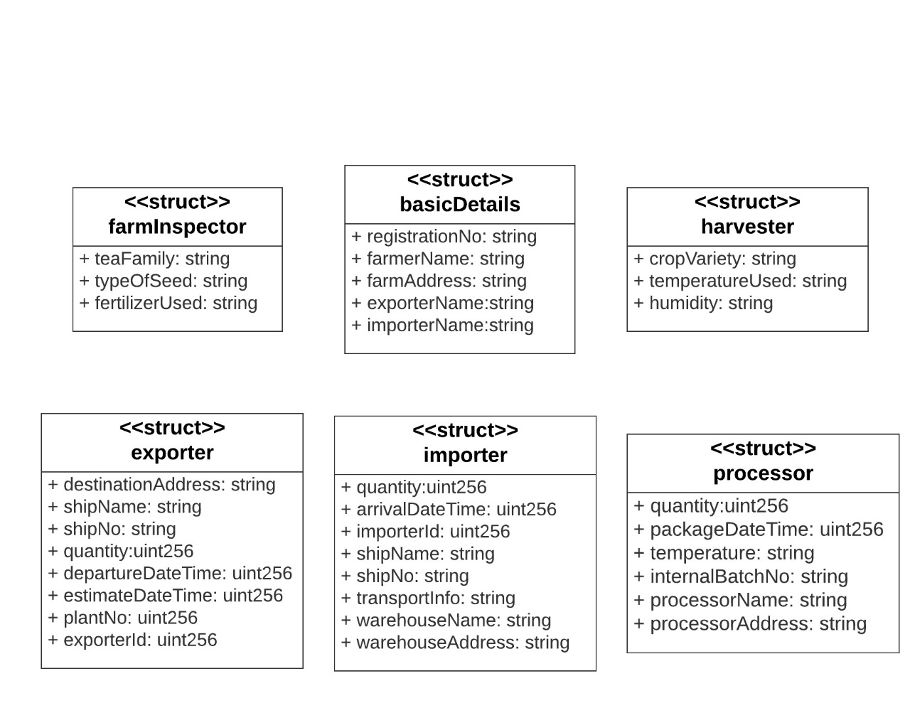
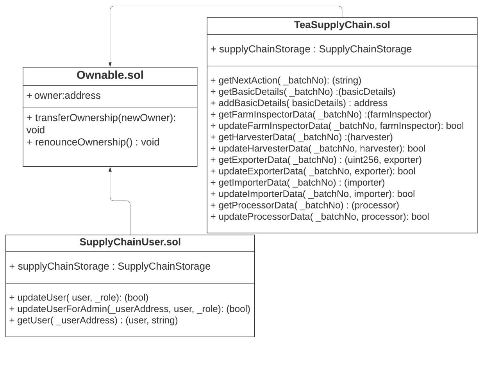

# Implementation of Tea Supplychain using Ethereum Smart Contract

This project showcases the journey of tea on blockchain. 

#### Problems in Existing System
---

- Low shipment visibility
- Slow process and error prone paperwork
- Lack of coordination
		
 

#### What we are providing?
---

- We have implemented smart contract addressing the issue of storing critical data necessary at different stages of supplychain and making it verifiable by all stakeholders in supplychain.
- Reduced paperwork and fast process
- Seamless collaboration between all parties


#### Application Workflow Diagram
---


#### In this application we have Six stages
---

1. Admin
2. Farm-Inspector
3. Harvester
4. Exporter
5. Importer
6. Processor



**Admin :** Admin creates new batch which is initial stage of coffee batch.

**Farm-Inspector :**  Farm-inspectors are responsible for inspecting coffee farms and updating the information like coffee family, type of seed and fertilizers used for growing coffee.

**Harvester :** Harvesters conducting plucking, hulling , polishing , grading and sorting activities, further updating the information of crop variety, temperature used and humidity maintained during the process.

**Exporter :** Exporters are the organization who exports coffee beans throughout the world. Exporter  adds quantity, destination address, ship name, ship number , estimated date and time and exporter id.

**Importer :** Importers imports the coffee from coffee suppliers and  updates quantity, ship name, ship number , transporters information, warehouse name, warehouse address and the importer's address.

**Processor :** Processors are the organizations who processes raw coffee beans by roasting them on particular temperature and humidity and makes it ready for packaging and to sale into markets. Processor adds the information like quantity, temperature , roasting duration , internal batch number , packaging date time, processor name and processor address.

#### Included Components
---
-  Solidity (Ethereum)
-  Metamask  (Ethereum wallet)
-  Rinkeby test network ( use rinkeby faucet to get ethers on rinkeby network )
-  Infura
-  Truffle
-  IPFS
-  Web3JS
-  Apache and PHP

#### Prerequisites
---
- Nodejs v9.10 or above
- Truffle v4.1.8 (core: 4.1.8) (http://truffleframework.com/docs/getting_started/installation)
- Solidity v0.4.23
- Metamask (https://metamask.io) /Ganache Wallet
> [Please Note : infura.io provider is used for the demo ]

#### Deployment Steps:
---
**Setting up Ethereum Smart Contract:**

```
git clone https://github.com/nikhil6418/tea-supplychain-ethereum-master
cd coffee-supplychain-ethereum/
```

**Update truffle.js **

```
var HDWalletProvider = require("truffle-hdwallet-provider");
module.exports = 
{
    networks: 
    {
	    development: 
		{
	   		host: "localhost",
	   		port: 8545,
	   		network_id: "*" // Match any network id
		}  
    }
};
```

Go to your project folder in terminal then execute :

```
rm -rf build/
truffle compile 
npm install truffle-hdwallet-provider
truffle migrate --network development reset
```

#### Contract Structure:
---





